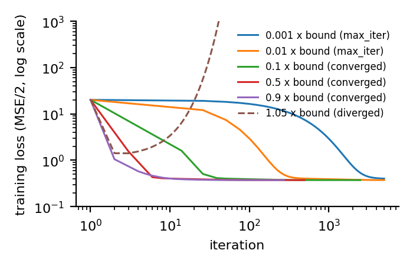
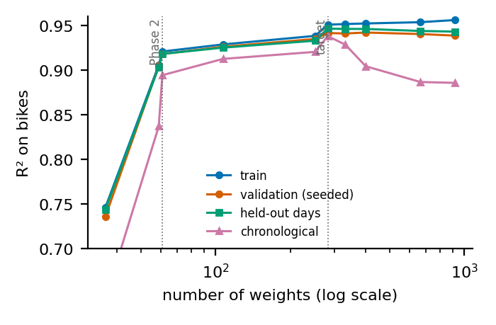
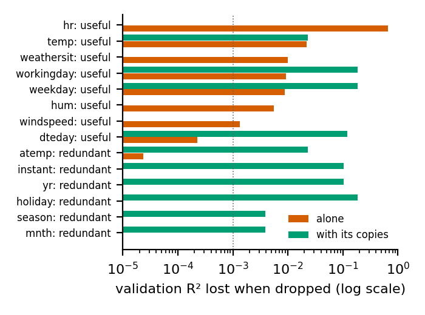
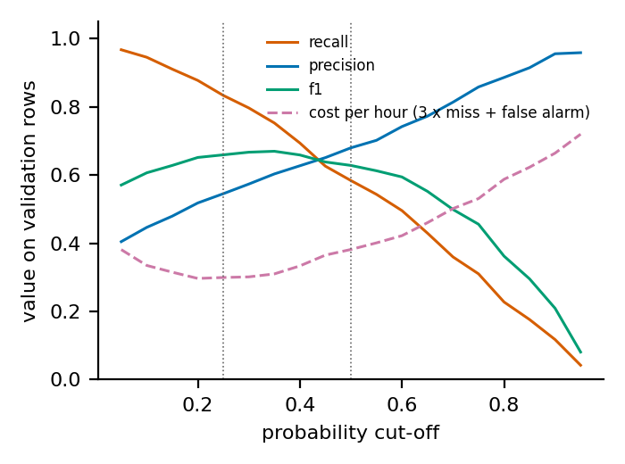

# Rush Hour: predicting hourly bike demand with a five-phase chained pipeline

Team IDs 16006283, 16007032, 16009837 · team seed 44615 · Machine Learning, Winter 2026, Project 1. Every number below is read from our own `artifacts/*.json`; the notebook reproduces them. We ran the chain twice: a first complete pass with a log target (git tag `v1-submitted`), and the second pass reported here, which changes only the target transform (Section 2). Where the first pass taught us something we say so.

## 1 What the data forced us to do

`train.csv` holds days 1–19 of every month of 2011–2012 and `test.csv` the 20th of every month, so the hidden test is whole unseen days inside the same two years. Three findings shaped every later choice. **(a) The signal is hour × day type:** working days have two commute peaks, other days one midday hump; a model with one hour profile cannot fit both. **(b) Demand grew strongly** from 2011 to 2012 and is right-skewed with spread growing with level, so we fit a transformed count throughout (Section 2) and always report R² and RMSE on bikes after transforming back. **(c) Several columns are copies:** `atemp` of `temp` (r = 0.985), `season` of `mnth`, `workingday` of `weekday` and `holiday` (exactly), and `yr`, `instant` and the date all measure time. Quirks: humidity is 0 on one day (sensor failure, replaced by the training median), weather situation 4 occurs once (merged into 3), `cnt` is never 0 and night hours are the ones missing, so our models never see a zero-demand hour.

**Splits.** One seeded 80/20 split (8708 / 2178 rows) gives every reported score and every tuning decision. Scalers, the humidity fill, expansions, every model fit and the class thresholds use the training rows only; every keep-or-drop decision (back-transform, degree, target level, penalties, column verdicts and therefore the surviving feature subset) is made on the validation set, which the task allows as tuning. Two further estimates are shown next to the validation score but never used to report "validation": five folds of whole held-out days inside the training portion (fixed by the calendar, no seed), and the one chronological split of Phase 3. `test.csv` is read once, at the end.

## 2 Phase 1: gradient descent

**Representation.** 35 standardised columns: 23 hour dummies, `workingday`, `holiday`, two weather dummies, `temp`, `hum`, `windspeed`, a trend in days and two day-of-year sine/cosine pairs from `dteday`. Hour as one number gives validation R² 0.260, six harmonics 0.729, dummies 0.736; we kept the dummies. The copies listed above stay out until Phase 4 so that the weights are unique (condition number 45.5).

**Learning rate and stopping.** For the MSE loss gradient descent is stable only below 2/λ_max of XᵀX/n. We compute λ_max = 1.975 and use half the bound, lr = 0.5064, starting from zeros. Sweep at fixed data and start: at 0.001 and 0.01 of the bound the run has not finished after 5000 iterations (stall); at 0.1 it needs 2499; ours 496; at 1.05 the loss explodes after 93 (Figure 1a). We stop when the relative loss change is below 1e-10 and the gradient norm below 1e-6: either test alone can fire on a plateau. The final weights match the closed-form solution to within 1e-5 (used only as a check).

**Target transform.** We fit z = ((cnt + 1)^λ − 1)/λ with λ = 0.1; λ → 0 is the log and λ = 1 the raw count. Our first pass used the log. It treats an error of four bikes at 3 am like an error of two hundred at 5 pm, while R² on bikes is decided by the busy hours; the raw count loses the multiplicative structure instead. With the Phase 1 design, validation R² is 0.7212 for the log, 0.7361 at 0.1, 0.7416 at 0.3 (the best for this small model) and 0.6939 for raw counts. The exponent must be the same in every phase, or Phase 2 could not start from Phase 1's weights, and the best exponent shrinks as the model gains structure; we fix 0.1, the value the final design prefers (Phase 3 re-checks it), knowing it is not this phase's own optimum. This choice comes from the first pass, not from Phase 1 alone.

**Back-transform.** Chosen on validation between no factor (R² 0.7278; predictions average 0.92 of the true mean) and a least-squares factor s = Σ(cnt+1)q/Σq² = 1.069 on q = (λz + 1)^(1/λ) (R² 0.7361). We keep the factor for all phases. In the first pass Duan's smearing, the textbook correction for a log model, was the worst option (0.718 → 0.696): the large log-errors sit in quiet night hours while the factor inflates the peaks.

**Result.** Validation R² 0.7361 (95% bootstrap interval 0.712–0.759), RMSE 94.7; train R² 0.7462; first pass 0.7212. The residuals by hour differ sharply between day types, which is what Phase 2 addresses. *Surprise:* we expected the milder transform to bring the back-transform factor closer to 1; it moved from 1.041 to 1.069.

**Bonus: asymmetric cost.** With under-prediction three times as costly, we minimise L(w) = (1/n) Σ cᵢ(ŷᵢ − yᵢ)², ŷᵢ = q(xᵢ·w) − 1 with q(η) = (λη + 1)^(1/λ), cᵢ = 3 if ŷᵢ < yᵢ and 1 otherwise, on bikes because the cost is paid in bikes. Since q′(η) = (λη + 1)^(1/λ − 1) = q(η)^(1−λ), the chain rule gives ∇L = (2/n) Σ cᵢ(ŷᵢ − yᵢ) q(ηᵢ)^(1−λ) xᵢ (for the log, λ → 0, this is exp(ηᵢ)xᵢ); cᵢ jumps only where the residual is zero and adds no term. The loss is not quadratic, so we use gradient descent with a backtracking step from the Phase 1 weights (2300 iterations, "converged"). Predictions shift up by a factor 1.28; the share of under-predicted validation hours falls from 0.50 to 0.31, the asymmetric cost from 22107 to 14007, and plain RMSE rises from 96.2 to 99.9. As a control we fitted the same bike-scale loss with k = 1: fitting on bikes alone shifts predictions by 1.089 (under-predicted share 0.43), and the asymmetry adds a further 1.178, so about two thirds of the shift is the operator's asymmetry. (In this comparison the Phase 1 model is used without its back-transform factor.)

## 3 Phase 2: polynomial regression

**Initialisation.** The 35 base columns keep the Phase 1 scaler from `p1.json`; new columns get their own; the weight vector is Phase 1's with zeros in the new slots. The first Phase 2 loss therefore equals the last Phase 1 loss (0.373581, difference below 1e-9, asserted in the notebook).

**What we expanded.** Only where Phase 1's residuals showed structure: the 23 degree-2 products `workingday × hour` (without them the expanded model reaches 0.7499) and powers of `temp`. Adding powers of `hum` or `windspeed` changes validation R² by less than our tolerance (0.9178 → 0.9181 → 0.9180). `trend` is never raised to a power: a polynomial in time bends away outside the observed dates.

**Degree.** Rule fixed before the run: the smallest degree within 0.001 of the best. Validation R² by degree 1–4: 0.9045, 0.9144, 0.9180, 0.9180 → degree 3.

**Result.** 61 weights, 636 iterations at half the bound (lr 0.3650), validation R² 0.9178, RMSE 52.8; gain over Phase 1 0.182 (paired interval 0.161–0.206); train R² 0.9206; first pass 0.9105. *Surprise:* optimisation stayed easy (condition number 64), because powers and products are built from standardised columns.

## 4 Phase 3: bias–variance and the time question

**What we varied.** A nested ladder anchored at the Phase 2 design (level C3, loaded from `p2.json`): below it we remove what Phase 2 added, above it we add blocks until cells hold only a few rows. We also varied the degree alone (2 to 8: validation R² moves by 0.0041, a flat line that proves nothing) and the amount of training data. Sweeps use the closed-form solution, which our gradient descent reproduces to 1e-5.

| level (weights) | train | validation | held-out days | chronological |
|---|---|---|---|---|
| C1 additive (36) | 0.746 | 0.736 | 0.744 | 0.644 |
| C3 = Phase 2 (61) | 0.921 | 0.918 | 0.918 | 0.894 |
| C4 + hour × temp, hour × hum (107) | 0.929 | 0.926 | 0.925 | 0.912 |
| C5 + weekday × hour (251) | 0.938 | 0.935 | 0.933 | 0.920 |
| C6 + weather detail and memory (282) | 0.951 | 0.941 | 0.946 | 0.938 |
| C8 + hour × season, hour × trend (401) | 0.952 | 0.942 | 0.946 | 0.904 |
| C10 + month × day type × hour (918) | 0.956 | 0.938 | 0.943 | 0.886 |

**Diagnosis: Phase 2 is under-fit (bias), not over-fit.** Its train–validation gap is 0.0028; its learning curve is flat (0.909 with a tenth of the training days, 0.918 with all); and adding blocks raises validation R² by 0.023 (paired interval 0.018–0.030), confirmed on held-out days (+0.028) and chronologically (+0.044). Variance appears only at the top: from level 10 on, train R² keeps rising while all three held-out scores fall (Figure 1b).

**The time question.** We train before 2012-07-01 and validate after (a quarter of the file, half a seasonal cycle, each month seen at least once in training). For Phase 2 the three estimates are 0.918 (seeded), 0.918 (held-out days) and 0.894 (chronological); for the target 0.941, 0.946 and 0.938. We separated the two possible causes of a gap. Sharing days between training and validation is worth nothing to these models (-0.0002, against a fold spread of 0.013): a linear model with a few hundred weights cannot recognise an individual day. A tree model we tried outside the pipeline can, and scores 0.016 higher on the seeded split than on held-out days, so the warning in the brief is real; our model class is too stiff to profit. What gap there is, 0.024 for Phase 2 and 0.008 for the target, is drift: after the cut mean demand is 262 against 168 bikes and the trend overshoots it (target predictions average 1.06 times the truth). **We trust the chronological estimate for future periods**; for our hidden test, which lies inside the observed period, held-out days are the closest match. The diagnosis does not change in kind, the simpler models are worse on every split, but the chronological split is the one that punishes the levels above the target (0.938 at C6, 0.904 at C8), so it limits how far up we go. *Biggest lesson of the second pass:* with the log target the same design scored 0.914 chronologically and over-shot the later months by a factor 1.11. Most of what we had called drift was our own target: a straight trend on the log scale is exponential growth.

**Target complexity.** Rule: the simplest level within 0.001 validation R² of the best → C6_weather_detail, 282 weights. Two disclosures. Our first rule was plain "highest validation R²"; on its first run it preferred a level 140 weights larger on a difference of 0.0005, so we replaced it with the tolerance rule we already used for the degree. And level C6 was added after a residual analysis of C5 (error concentrated in working-day rush hours and in rain): powers of humidity, wind terms, `workingday × hour × temp`, and the weather situation of the previous one and three hours (inputs only). It was accepted because it gained on held-out days in every fold and on the chronological split; having been designed after looking at validation errors, its validation score is the most optimistic number in this report. **Exponent check.** On the target design validation R² is 0.9390 for the log, 0.9410 at 0.05, 0.9413 at 0.1, 0.9405 at 0.15 and 0.9231 at 0.5; held-out days agree (0.9426 → 0.9462). The exponent fixed in Phase 1 is the best on validation, so the chain is consistent. The chronological split would prefer 0.15 (0.941 against 0.938); we keep the validation choice.

## 5 Phase 4: regularization and column verdicts

**Search, informed by Phase 3.** The model we carry forward is not over-fit, so the grid must reach practically zero and include the unpenalised fit as reference. All three methods use the same standardised design (the target plus the held-back copies `atemp`, `yr`, `instant`, `season`, `mnth`, so every original column is present), the same rows, 40 log-spaced penalties each (Ridge 1e-06–1000; Lasso and Elastic Net from the all-zero penalty down to a ten-thousandth of it; l1_ratio in six steps from 0.1 to 0.95), the same rule (highest validation R² on bikes) and the same checks. Ridge is closed-form; Lasso and Elastic Net are our own coordinate descent; our unit tests compare all three with a reference library (agreement better than 1e-3). 7 Lasso fits at one large penalty on this design, none of them chosen, used all 20000 sweeps without meeting our tolerance: exactly duplicated columns make coordinate descent crawl; on the survivors every fit converged.

| stage A: full design (299 weights) | λ | l1_ratio | non-zero | validation R² | RMSE | held-out days | chrono |
|---|---|---|---|---|---|---|---|
| unpenalised | – | – | – | 0.9393 | 45.4 | – | – |
| Ridge (L2) | 0.001000 | – | 298 | 0.9405 | 44.9 | 0.9450 | 0.929 |
| Lasso (L1) | 0.000215 | – | 285 | 0.9406 | 44.9 | 0.9452 | 0.929 |
| Elastic Net | 0.000226 | 0.95 | 285 | 0.9406 | 44.9 | 0.9452 | 0.929 |

**Comparison.** The three are tied with each other: the paired bootstrap interval of every pairwise difference contains zero (for example Lasso − Ridge 0.0001, interval -0.0001 to 0.0003), and Elastic Net chose l1_ratio 0.95, which makes it almost Lasso. Against the unpenalised fit the penalty gains 0.0014 (interval 0.0004 to 0.0024): measurable on this design, which still carries the duplicated columns, and small. Regularization here is insurance, not a cure, exactly what an "under-fit" diagnosis implies. Where the model is over-fit it does help: on the top ladder level Lasso lifts validation R² from 0.9384 to 0.9394 keeping 587 weights, still not above our recommended model (difference -0.0018, interval -0.0046 to 0.0011). Penalties chosen on held-out days instead would have changed validation R² by at most 0.001. Lasso is not sparse (285 weights survive): the signal is spread over many hour-specific columns.

**Verdict for every column.** Rule fixed before the run; reference = Ridge at its chosen λ. *Useful:* dropping every feature built from the column lowers validation R² by at least 0.001 with a paired interval above zero. *Redundant:* dropping it alone costs nothing, but dropping it with its measured copies does, or it explains at least 0.01 on its own. *Uninformative:* neither. Where a group of copies matters but no member is missed alone, the member that explains most on its own is kept as the useful representative (marked *).

| column | verdict | Δ R² if dropped alone [95% interval] | Δ R² if dropped with copies | R² alone | Lasso keeps (freq.) | carried by |
|---|---|---|---|---|---|---|
| hr | useful | 0.6594 [0.6112, 0.7079] | – | 0.491 | 23 of 23 (1.00) | |
| temp | useful | 0.0218 [0.0164, 0.0283] | 0.0229 | 0.095 | 3 of 3 (1.00) | |
| atemp | redundant | 0.0000 [-0.0001, 0.0002] | 0.0229 | 0.114 | 1 of 1 (0.92) | temp |
| hum | useful | 0.0055 [0.0024, 0.0083] | – | 0.104 | 3 of 3 (1.00) | |
| windspeed | useful | 0.0014 [0.0001, 0.0026] | – | 0.014 | 2 of 2 (1.00) | |
| weathersit | useful | 0.0100 [0.0044, 0.0160] | – | 0.019 | 6 of 6 (1.00) | |
| workingday | useful | 0.0092 [0.0037, 0.0166] | 0.1851 | -0.000 | 1 of 1 (0.66) | |
| weekday | useful | 0.0088 [0.0059, 0.0117] | 0.1851 | 0.002 | 5 of 6 (1.00) | |
| holiday | redundant | 0.0000 [-0.0000, 0.0000] | 0.1851 | 0.000 | 1 of 1 (0.78) | weekday, workingday |
| dteday (trend, season terms) | useful* | 0.0002 [-0.0004, 0.0008] | 0.1203 | 0.125 | 3 of 5 (1.00) | |
| yr | redundant | 0.0000 [-0.0001, 0.0001] | 0.1029 | 0.066 | 1 of 1 (0.72) | dteday |
| instant | redundant | 0.0000 [-0.0000, 0.0000] | 0.1029 | 0.088 | 0 of 1 (0.00) | dteday |
| season | redundant | -0.0000 [-0.0001, -0.0000] | 0.0039 | 0.052 | 1 of 3 (0.98) | dteday |
| mnth | redundant | -0.0008 [-0.0015, -0.0001] | 0.0039 | 0.061 | 9 of 11 (0.94) | dteday |

Three things in this table surprised us. Lasso's choice between copies is arbitrary and once backwards: it keeps `atemp`, which costs nothing to drop, in most resampled fits and never keeps `instant`, which alone explains 0.088; so "Lasso set it to zero" was evidence for us but never the verdict. `dteday` is useful only as a group: its copies can replace it completely (cost alone 0.0002, with them 0.120). And `windspeed` is useful only since Phase 3 gave it a square and an interaction with temperature; as a single linear column the same rule had called it uninformative. A verdict judges a column as we represented it (Figure 2a). One apparent contradiction: `workingday` is an exact function of `weekday` and `holiday`, yet both `workingday` and `weekday` are useful. The copy is exact only for the column itself; each is missed through its own hour profile (`workingday × hour` separates holidays from ordinary weekdays hour by hour, `weekday × hour` separates Friday evenings and Saturdays from Sundays), while `holiday` on its own adds nothing once those are present.

**Survivors and final model (stage B).** We first remove every feature built from a column that is not useful (280 features remain), then run Lasso on that reduced design; a feature survives if its weight is non-zero at the chosen λ and it is selected in at least 0.6 of 50 Lasso fits on resampled training days: 277 → 277 features. Lasso removes almost nothing here, so the subset is decided almost entirely by the verdicts, which are validation-set decisions. (Our first version took the Lasso zeros before removing the copies; Lasso had let month dummies and `instant` stand in for date terms, the verdict step then removed the stand-ins, and the chronological score fell by about 0.013. We corrected the order.) The redundant columns add nothing: dropping `mnth` alone changes validation R² by -0.0008, so the model is slightly better without it. We therefore repeated the same search on the survivors only and recommend among those: Ridge 0.9413 / 0.9462 / 0.938 (validation / held-out days / chronological), Lasso 0.9413 / 0.9463 / 0.938, Elastic Net 0.9413 / 0.9463 / 0.938. They are again tied on validation, and Ridge's best penalty is the smallest on our grid (0.000001), i.e. none: the unpenalised fit on the survivors scores 0.9413. Once the copies are gone, nothing is left for a penalty to fix; our rule (within noise on validation, then best on held-out days) recommends **l1** with λ = 0.000170, l1_ratio 1.0: validation R² 0.9413, RMSE 44.7 (first pass: 0.9390 and 45.5; held-out days 0.9428 → 0.9463, chronological 0.914 → 0.938). This second stage was added after the first Phase 4 run; all runs are in the git history.

## 6 Phase 5: logistic regression

**Label.** A single global threshold has an obvious flaw: "high" then just means rush hour. Under the global 75th percentile, hour dummies alone reach ROC-AUC 0.855 and the full model 0.985: impressive and useless, the operator already has a clock. A threshold per (day type, hour) fixes the clock but not the calendar: 0.054 of 2011 validation hours are positive against 0.421 of 2012, and the trend alone reaches 0.810. **Our label:** `cnt` above the 75th percentile of training hours with the same year, day type and hour (96 thresholds from the training rows, at least 50 hours each): "busier than three quarters of comparable hours", the case where the normal allocation runs short. Positives are 0.246 of training and 0.250 of validation hours (0.239 / 0.262 by year); hour alone is at chance (0.501) and trend alone at 0.577.

**Model.** Our own logistic regression (gradient descent on the log-loss, lr = 1/(λ_max/4 + l2), gradient-checked) on the 277 Phase 4 survivors only (asserted). A small ridge term is chosen by validation ROC-AUC: l2 = 0.001, 2954 iterations.

**Metrics for a 1:3 class balance.** Always answering "normal" is right 0.750 of the time, so accuracy flatters; we read it with F1, precision, recall, ROC-AUC and PR-AUC. **Threshold.** A missed high-demand hour (empty docks) costs more than a false alarm; with the 3:1 ratio of the bonus the cost-minimising cut-off of a calibrated model is 1/(1+3) = 0.25.

| cut-off | accuracy | F1 | precision | recall | ROC-AUC | PR-AUC | cost per hour |
|---|---|---|---|---|---|---|---|
| 0.25 (ours) | 0.784 | 0.659 | 0.545 | 0.833 | 0.885 | 0.728 | 0.299 |
| 0.5 | 0.827 | 0.628 | 0.679 | 0.583 | 0.885 | 0.728 | 0.382 |

ROC-AUC has a 95% interval of 0.869–0.900. At 0.25 we catch 0.83 of the high-demand hours at a precision of 0.55; at 0.5 accuracy looks better but 227 high-demand hours are missed instead of 91. On validation the cost is lowest at a cut-off of 0.2, the theoretical value, and the largest calibration gap is 0.091. *Surprise:* accuracy is lower at our cut-off than at 0.5 and barely above the do-nothing baseline; judged by accuracy our operating point looks like a mistake, judged by the operator's cost (0.299 against 0.382 per hour) it is clearly better (Figure 2b). The honest label is also far harder than the trivial one (AUC 0.885 against 0.985): whether an hour is unusually busy for its slot depends on things we only partly observe.

## 7 Retrospective, final model and what we do not claim

| phase | consumes | key choices | weights | validation |
|---|---|---|---|---|
| 1 GD | seeded split | lr 0.506 = half the bound, 496 iterations | 36 | R² 0.736, RMSE 94.7 |
| 2 Polynomial | P1 weights as start | degree 3 (temp), workingday × hour | 61 | R² 0.918, RMSE 52.8 |
| 3 Bias–variance | P2 degree and features | under-fit; target C6_weather_detail | 282 | R² 0.941; days 0.946; chrono 0.938 |
| 4 Regularization | P3 target and diagnosis | λ per method (table), 277 survivors, l1 | 278 | R² 0.941, RMSE 44.7 |
| 5 Logistic | P4 survivors | year × day type × hour label, cut-off 0.25 | 278 | acc 0.784, F1 0.659, AUC 0.885 |

The chain is checked in code: each artifact stores the hash of the one it consumed; Phase 2's first loss equals Phase 1's last; Phase 3's anchor is Phase 2's design; Phase 4's design is Phase 3's target; Phase 5's features are a subset of Phase 4's survivors. The story the numbers tell is one of bias: each step that added structure the data really has (day-type hour profiles, then weather by hour, then weekday profiles, then weather detail) raised validation R² from 0.74 to 0.94, while penalties, the classical cure for variance, changed almost nothing. The one exception to "add structure" was our own target: replacing the log by a milder transform was worth more on unseen months than any feature.

**Submitted model.** l1 on the Phase 4 survivors with the validated hyper-parameters, weights refitted on training + validation rows (10886 rows; the Phase 3 learning curve of the target is still rising at full size) with scaler and humidity fill kept as fitted on the training rows. Refit and validated model agree on the test rows (correlation 0.9997, mean ratio 1.001). Sanity of the 574 predictions: none negative, mean 199.3 bikes (training mean 191.6), per (day type, hour) cell between 0.81 and 1.15 times the training profile.

**What we do not claim.** (1) Validation scores are slightly optimistic: the exponent, back-transform, degree, target level and penalties were all chosen on the same 2178 rows. Rules and designs were changed after first results: the Phase 3 target rule, one ladder level, the order of the selection step, the second stage of Phase 4, and, in the second pass, the target transform itself. Held-out days and the chronological split are our guard, but they are not untouched either: both were looked at when we accepted those changes, and the two weather-memory columns are built from the weather (never the counts) of neighbouring rows before the split. For unseen future months the least optimistic figure we have is the chronological 0.938, not 0.941. (2) The trend is a straight line on the transformed scale: fine inside 2011–2012, still somewhat too steep beyond. (3) The model has never seen a zero-demand hour, a new weather regime, or a holiday type absent from training; the Phase 5 thresholds exist only for the two observed years. (4) What we tried and left out (all in `exp/v2/`, none in the pipeline): 20 more groups of input-only features, of which no weather or hour group moved held-out days by more than 0.0007; separate levels per calendar month, which gain 0.003 on held-out days and lose -0.054 chronologically; and observation weights, which gain 0.0025 on held-out days at a paired standard error of 0.0014, below our two-standard-error rule. A diagnostic tree model scores 0.950 on held-out days and 0.902 chronologically; our final model is at 0.946 and 0.938. The remaining error is mostly a whole-day offset we cannot observe.

<b>Figure 1a.</b> Phase 1 loss for six learning rates given as fractions of the stability bound: stall, converge, diverge.

<b>Figure 1b.</b> Phase 3 ladder: training R² keeps rising with the number of weights; the three held-out estimates peak at the target and then fall, the chronological one most.

<b>Figure 2a.</b> Phase 4: validation R² lost when a column is dropped alone and together with its copies (dotted line: the 0.001 threshold).

<b>Figure 2b.</b> Phase 5: precision, recall, F1 and operator cost against the probability cut-off (dotted lines: 0.25 and 0.5).

